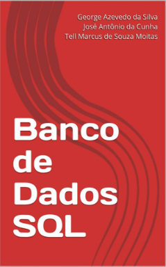

# Apresentação

Este livro foi escrito com base no conteúdo da disciplina de Banco de Dados ministrada pelos professores José Antônio e George Azevedo, do curso graduação Tecnológica em Análise e Desenvolvimento de Sistemas do IFRN - Instituto Federal do Rio Grande do Norte.

_O código-fonte deste livro está em:_ [**https://github.com/tellmoitas/Banco-de-Dados-SQL**](https://github.com/tellmoitas/Banco-de-Dados-SQL)

O livro "Programação de Banco de Dados: Conteúdo didático"

(**ASIN**: B07DWCK47B\)

( **ISBN:** 9781091375901\)

Está disponível na Loja Kindle_ [_**aqui**_](https://www.amazon.com.br/dp/B07DWCK47B?ref_=pe_2427780_160035660).

## José Antônio

* _E-mail_: [jose.cunha@ifrn.edu.br](mailto:jose.cunha@ifrn.edu.br)

## George Azevedo

* E-mail: [george.azevedo@ifrn.edu.br](mailto:george.azevedo@ifrn.edu.br)

## Tell Moitas

* E-mail: [tell.moitas@escolar.ifrn.edu.br](mailto:tell.moitas@escolar.ifrn.edu.br)

