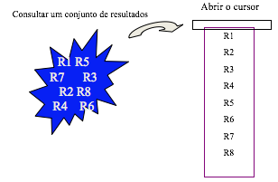
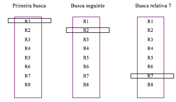
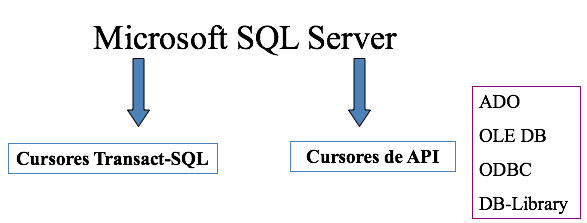

# Cursores


Cursores Transact\_SQL

Um banco de dados relacional como o SQL Server, o Oracle, etc é naturalmente orientado a conjuntos. Isto significa, que uma dada instrução como SELECT, retornará um conjunto de resultados – muitas vezes representado por mais do que uma linha de dados.

Por outro lado a maioria das linguagens de programação, bem como muitas aplicações, tendem a ser definitivamente baseada em registro \(lista de clientes\). 

A incompatibilidade entre a abordagem orientada a conjuntos e a abordagem baseada em registro é, algumas vezes, conhecida como, incompatibilidade de impedância. Então, o que fazer com essa incompatibilidade? Os SGBDs fornecem uma ponte significativa entre os dois modelos: **os cursores**.

Você pode pensar em um cursor como conjunto de resultados nomeado, no qual sempre é mantida uma posição atual, à medida que você move ao longo do conjunto de resultados. É como, por exemplo, se você estivesse examinando nomes em um caderno de endereços. Seu dedo atua como um cursor – ele funciona como um ponteiro para a entrada atual, dentre as muitas que você tem à sua frente. Pense nas entradas na página atual do caderno de endereços como um conjunto de resultados de sua consulta. 

O SQL Server, Oracle, etc tem tipos diferentes de cursores, que você pode escolher com base em suas necessidades de rolagem e no quanto deseja que o cursor esteja protegido de alterações de dados feitas por terceiros.





Fundamentos de cursores

•       Declarar um cursor

•       Abrir um cursor

•       Fechar um cursor

•       Liberar um cursor

•       Usar um comando FETCH simples

•       Colocar um registro em variáveis

•       Colocar um registro pela sua posição absoluta

•       Colocar um registro pela sua posição relativa

•       Realizar uma atualização posicionada

•       Realizar uma exclusão posicionada

**O que é um cursor?**

Um cursor é um objeto que aponta para uma determinada linha dentro de um conjunto.



Os cursores Tansact-SQL – são cursores do lado do servidor.

Os cursores API – podem ser tanto do lado cliente, quanto do lado servidor.

O que isso significa?

Características do cursor

•       Sua capacidade de refletir alterações em dados subjacentes;

•       Sua capacidade de rolar pelo conjunto de linhas;

•       E sua capacidade de atualizar o conjunto de linhas.

Tipos de cursores

•       Static;

•       Keyset;

•       Dynamic;

•       Firehose.

**Static**: um cursor static faz uma espécie de ‘foto’ dos dados especificados pela sua instrução SELECT e a armazena no banco de dados tempdb. Ele é apenas de leitura. Ele pode ser forward-only \(apenas para frente\) ou scrollable\(rolável\).

**Keyse**t: um cursor keyset copia para o tempdb apenas as colunas necessárias para identificar exclusivamente cada linha.  O cursor keyset pode ser updatable \(atualizável\) ou read-only \(somente leitura\) e também scrollable\(rolável\) ou forward-only\(apenas para frente\). Linhas adicionadas nas tabelas subjacentes não serão adicionadas ao cursor. Alterações feitas por outro usuário, não se refletirão no cursor.

**Dynamic:** teoricamente os cursores dynamic comportam-se como se uma instrução SELECT fosse lançada novamente sempre que uma linha fosse referenciada. Os cursores dynamic refletem as alterações de valor tanto da associação quanto dos dados subjacentes, quer essas alterações tenham sido feitas pelo cursor ou por qualquer outro usuário.

Porém, há uma restrição para o cursor dynamic: a instrução SELECT usada para defini-lo só pode conter uma cláusula ORDER BY se existir um índice contendo as colunas na cláusula ORDER BY. Se você declarar um cursor dynamic com uma cláusula ORDER BY que não esteja apoiada por um índice, o SQL converterá o cursor para o cursor keyset.

**Firehose:** Esta é uma forma especializada de cursor do tipo somente leitura fixa, suportada pelo SQL Server. Esses cursores são muito eficientes, mas existem duas restrições importantes quanto ao seu uso:

1. Se a instrução SELECT que você usou para definir o cursor referenciar colunas text, ntext ou image e contiver a cláusula TOP, o SQL Server converterá o cursor firehore em um cursor keyset.
2. Se a instrução SELECT que você usou para definir o cursor combinar tabelas que contenham gatilhos com tabelas que não tenham gatilhos, cursor será convertido para um cursor static.

### **Usando cursores**

Usar um cursor é como usar uma variável local – você o declara, define o seu valor e, depois, o usa. Ao contrário das variáveis locais, porém, que são destruídas automaticamente quando ficam fora do escopo, você deve liberar explicitamente uma variável usada por um cursor e, depois destruí-la.

**Criando cursores – sintaxe:**

```sql
DECLARE nome_cursor CURSOR
[visibilidade]
[rolagem]
[tipo]
[bloqueio]
[DIGITAR_AVISO]
FOR instrução_select
[FOR UPDATE [OF nomes_colunas]]
```

Visibilidade:  LOCAL ou GLOBAL

Rolagem: FORWARD\_ONLY e SCROLL

Tipo: STATIC, KEYSET, DYNAMIC e FAST\_FORWARD\(Firehose\)

Bloqueio:

READ\_ONLY – nenhuma alteração pode ser feita aos dados subjacentes pelo cursor. \(UPDATE\)

SCROLL\_LOCKS – as atualizações podem ser feitas apenas          pelo cursor.

OPTIMISTIC – permite atualizações tanto pelo cursor como e fora dele.

**DIGITAR\_AVISO**: Instrui O SQL Server para enviar uma mensagem de aviso para o cliente se um cursor for convertido do tipo especificado em outro tipo.

**Instrução\_select**: Especifica as linhas a serem incluídas no conjunto do cursor.

**FOR UPDATE**: Indica que o cursor é atualizável\(padrão, a menos que o bloqueio READ-ONLY seja especificado. OF nomes\_colunas especifica as coluna que serão atualizáveis. Se você omitir, então todas as colunas serão atualizáveis.

#### **Abra um cursor**

O conjunto do cursor não será criado até que você abra o cursor.

```sql
OPEN meu_cursor
```

#### **Feche um cursor**

Assim que você tiver terminado de usar um cursor, deve fechá-lo. A instrução CLOSE libera os recursos usados para manter o conjunto do cursor e também libera quaisquer bloqueios que tenham sido colocados nas linhas se você tiver usado o parâmetro SCROLLOCKS.

```sql
CLOSE meu_cursor
```

**Desaloque um cursor**

A última instrução na seqüência de criação do cursor é DEALLOCATE.

```sql
DEALLOCATE meu_cursor
```

Atenção!, a instrução DEALLOCATE remove o identificador do cursor ou variável do cursor, mas ela não remove necessariamente o cursor. O próprio cursor não será removido até que todos os seus identificadores sejam desalocados.

**Considere o seguinte exemplo:**

```sql
--Crie o cursor
DECLARE meuCursor CURSOR
            KEYSET
            READ_ONLY
            FOR SELECT * FROM authors
```

```sql
--Crie o conjunto do cursor
OPEN meuCursor
```

```sql
--Libere o cursor
DEALLOCATE meuCursor
```

#### **Manipulando linhas com um cursor**

O Transact-SQL suporta três comandos diferentes para trabalhar com cursores: FETCH, UPDATE e DELETE.

&lt;h2&gt; FETCH

O comando FETCH recupera uma linha específica do conjunto do cursor. Sua sintaxe é:

\`\`\`sql

FETCH cursor\_ou\_variável             

Esse formato retorna a linha na qual o cursor está posicionado \(a linha atual\).

Exemplo 1 - FETCH

\`\`\`sql

USE pubs

DECLARE simpleCursor CURSOR    --Cria o cursor LOCAL

FOR SELECT au\_fname, au\_lname FROM authors

OPEN simpleCursor                           --Cria o conjunto do cursor

FETCH simpleCursor                          --Recupera a 1ª linha

CLOSE simpleCursor                          --Libera o conjunto do cursor

DEALLOCATE simpleCursor             --Desaloca o cursor.

&lt;h2&gt; FETCH INTO

Em vez de retornar uma linha diretamente, o comando FETCH também permite que você armazene os valores de coluna retornados em variáveis.

Sintaxe:

\`\`\`sql

FETCH cursor\_ou\_variável

            INTO lista\_de\_variáveis

Você deve declarar as variáveis antes de executar o comando FETCH.  A lista de variáveis deve incluir uma variável para cada coluna na instrução SELECT que definiu o cursor e os tipos de dados devem ser compatíveis.

Exemplo 2 – FETCH INTO

\`\`\`sql

USE pubs

DECLARE simpleCursor CURSOR

            LOCAL

            FOR SELECT au\_fName, au\_LName FROM authors

DECLARE @pNome char\(20\), @sNome char\(50\)

OPEN simpleCursor               --Abre o cursor

FETCH simpleCursor

            INTO @pNome, @sNome

PRINT RTRIM\(@pNome\) + ' é o primeiro nome'

PRINT RTRIM\(@sNome\) + ' é o sobre nome'

CLOSE simpleCursor

DEALLOCATE simpleCursor

&lt;h2&gt; FETCH   FIRST/ABSOLUTE

Todos os exemplos anteriores usaram a instrução FETCH para retornar a linha atual. Três palavras-chaves permitem que você especifique uma posição absoluta no conjunto de cursores.

•       FIRST e LAST: retornarão a primeira e última linha, respectivamente

•       ABSOLUTE n: especifica uma linha no conjunto do cursor

Você pode especificar o valor de n como uma constante \(5\) ou como uma variável \(@linha.

Exemplo 3 – FETCH   FIRST/ABSOLUTE

\`\`\`sql

USE pubs

DECLARE simpleCursor CURSOR

            LOCAL

            KEYSET

            FOR SELECT au\_fname FROM authors

DECLARE @pNome char\(20\)

OPEN simpleCursor

\`\`\`sql

FETCH FIRST FROM simpleCursor

            INTO @pNome

PRINT RTRIM\(@pNome\) + ' é o primeiro nome'

FETCH ABSOLUTE 5 FROM simpleCursor

            INTO @pNome

PRINT RTRIM\(@pNome\) + ' é o 5º nome'

CLOSE simpleCursor

DEALLOCATE simpleCursor

&lt;h2&gt; FETCH  RELATIVE

Recuperando linha com base na sua posição relativa.

•       FETCH NEXT: retorna a linha seguinte

•       FETCH PRIOR: retorna a linha anterior

•       FETCH RELATIVE n: retorna uma linha n linhas da linha atual \(pode ser positivo ou negativo\).

Exemplo 4 – FETCH  RELATIVE

\`\`\`sql

USE  pubs

DECLARE simpleCursor CURSOR

            LOCAL

            KEYSET

            FOR SELECT au\_fname FROM authors

DECLARE @pNome char\(20\)

OPEN simpleCursor

\`\`\`sql

FETCH NEXT FROM simpleCursor

            INTO @pNome

PRINT RTRIM\(@pNome\) + ' é o primeiro nome'

FETCH RELATIVE 1 FROM simpleCursor

            INTO @pNome

PRINT RTRIM\(@pNome\) + ' é o próximo nome'

CLOSE simpleCursor

DEALLOCATE simpleCursor

Exemplo – 5   FETCH NEXT

\`\`\`sql

USE pubs

DECLARE simpleCursor CURSOR

       LOCAL

      FAST\_FORWARD

      FOR SELECT au\_fname FROM authors

DECLARE @Nome char\(20\)

DECLARE @count int

OPEN simpleCursor

\`\`\`sql

SET @count = 1

WHILE @count &lt;= 6

BEGIN

     FETCH NEXT FROM simpleCursor

            INTO @Nome

     PRINT RTRIM\(@Nome\) + ' Nome '          +        LTRIM\(STR\(@count\)\)

            SET @count = @count + 1

END

CLOSE simpleCursor

DEALLOCATE simpleCursor

&lt;h3&gt; ATUALIZAÇÃO POSICIONADA.

Atualizando e excluindo linhas com um cursor.

Desde que o cursor seja atualizável, alterar os valores subjacentes em um conjunto do cursor é bastante simples. Veja a seguir a sintaxe:

\`\`\`sql

UPDATE tabel\_ou\_visualização

SET LISTA\_DE\_ATUALIZAÇÃO

Where current of CURSOR\_OU\_VARIÁVEL

&lt;h2&gt; UPDATE

Exemplo 6 - UPDATE

\`\`\`sql

USE  PUBS

DECLARE simpleCursor CURSOR

      LOCAL

     KEYSET

    FOR SELECT AU\_fname, city FROM authors ORDER BY AU\_fname, city

  FOR UPDATE

OPEN simpleCursor

\`\`\`sql

FETCH NEXT FROM simpleCursor

UPDATE authors SET city = 'Natal'

            WHERE CURRENT OF simpleCursor

Select TOP 1 au\_fname, city FROM authors ORDER BY AU\_fname, city

CLOSE simpleCursor

DEALLOCATE simpleCursor

@@FETCH\_STATUS: retorna informações sobre o último comando FETCH que foi lançado.

-- 7.4 –

Exemplo 6 – @@CURSOR\_ROWS

\`\`\`sql

USE pubs

DECLARE simpleCursor CURSOR

            LOCAL

            STATIC

            FOR SELECT au\_fname FROM authors

OPEN simpleCursor

SELECT @@CURSOR\_ROWS AS CursorRows

FETCH simpleCursor

If @@FETCH\_STATUS &lt;&gt; 0

    ...

CLOSE simpleCursor

DEALLOCATE simpleCursor

Exemplo 7 - @@FETCH\_STATUS

\`\`\`sql

USE pubs

DECLARE simpleCursor CURSOR

            LOCAL

            STATIC

            FOR SELECT au\_fname FROM authors ORDER BY au\_fname

DECLARE @pNome char\(20\)

OPEN simpleCursor

FETCH NEXT FROM simpleCursor INTO @pNome

WHILE @@FETCH\_STATUS = 0

BEGIN

  PRINT RTRIM\(@pNome\)

  FETCH NEXT FROM simpleCursor INTO @pNome

END 

CLOSE simpleCursor

DEALLOCATE simpleCursor

