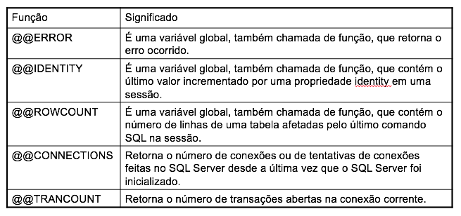
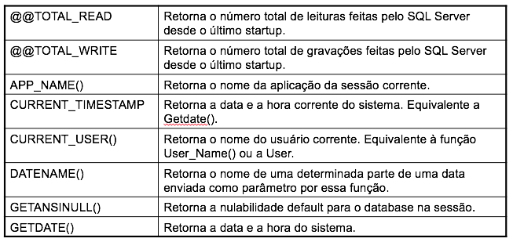
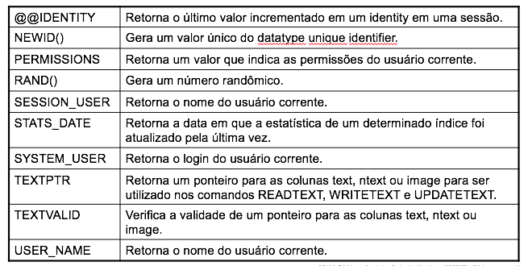

# Funções


**O que é uma função**

É um tipo de programa, criado no Servidor SQL Server, dentro de um database específico, que tem como principal objetivo retornar um valor ou um conjunto de valores para um usuário ou para outra função, para store procedure ou aplicação.

**Regras para a utilização de User Defined Functions\(UDFs\)**

1. Uma função definida pelo usuário pode receber parâmetros de entrada.
2. Os parâmetros de entrada de uma função não podem ser do datatype timestamp, cursor ou table.
3. Uma função definida pelo usuário não aceita parâmetros de saída \(parâmetro output\).
4. Uma função retorna um valor escalar ou os dados de uma tabela.
5. Dentro de uma UDF você não pode executar os comandos INSERT, UPDATE e DELETE.
6. Os comandos INSERT, UPDATE e DELETE podem ser utilizados para manipular dados de variáveis de memória do tipo tabela \(table\).
7. Para que um usuário possa executar uma UDF, ele deve ter permissão de SELECT nela.
8. Para executar uma função, você deve utilizar o comando SELECT e o nome qualificado por duas partes, ou seja, deve utilizar o nome do proprietário da função antes do nome dela para executá-la.
9. As UDFs não podem executar as funções determinísticas internas do SQL Server \(Funções Built-in\).







**Tipos de User Defined Functions \(UDF\)**

Você pode criar três tipos de funções:

•       Funções escalares;

•       Funções in-line: contêm apenas um comando SELECT para retornar os dados de uma tabela;

•       Funções que contêm vários comandos e retornam dados de uma tabela.

**Funções Escalares**

Uma função escalar é semelhante a uma função interna do SQL Server \(Built\_in Function\). Elas podem ou não receber parâmetros de entrada e retornar apenas um único valor.

**Funções Escalares - Sintaxe**

```sql
Create FUNCTION [Proprietário_da_função].Nome_da_Função
      ([{@parametro [AS] datatype_escalar [=default ] } [,...n]])
RETURNS [WITH <opção> [ [,] ...n] ]
[AS]
BEGIN
           Corpo da Função
            RETURN Valor_escalar
END
< opção > ::=
         { ENCRYPTION | SCHEMABINDING }
```

**Exemplo de Função Escalar**

A função seguinte tem como objetivo calcular a área de um triângulo mediante os valores recebidos pelos parâmetros de entrada @base e @altura.

```sql
Create FUNCTION F_AreaTriangulo (@base int, @altura int)
RETURNS float
AS
    BEGIN
               RETURN (  (@base * @altura) / 2 )
    END
```

**Para executar a função**

```sql
SELECT dbo.F_AreaTriangulo(5,30)
```

**Comandos para criar e popular a tabela Triangulos**

```sql
CREATE TABLE [dbo].[Triangulos](
            [id] [varchar](50) NOT NULL,
            [base] [int] NULL,
            [altura] [nchar](10) NULL
)
insert into Triangulos
values ('Triangulo Retangulo 3, 4', 3, 4)
insert into Triangulos
values ('Triangulo Retangulo 5, 8', 5, 8)
```

**Para executar a função**

```sql
select
  base, altura,   dbo.f_areatriangulo(base, altura) as area
from Triangulos
```

**Exemplo de Função Escalar – outro exemplo**

A função seguinte tem como objetivo calcular a área de uma circunferência mediante valores recebido pelo parâmetros de entrada @raio.

```sql
Create FUNCTION F_AreaCirculo (@raio int)
RETURNS Bigint
AS
    BEGIN
            DECLARE @area Bigint
            SET @area = PI() * POWER(@raio,2)
               RETURN @area
    END
```

**Funções In-line que Retornam Dados de uma Tabela**

```sql
Create FUNCTION [Proprietário_da_função].Nome_da_Função
      ([{@parametro [AS] datatype_escalar [=default ] } [,...n]])
RETURNS TABLE 
[WITH <opção > [ [,] ...n]
[AS]
            RETURN [ ( ] Comando SELECT [ ) ]
```

**Exemplo**

De acordo com a tabela Funcionário e seus dados apresentados em seguida, a função F\_DataCadastro\(\) recebe uma data como parâmetro  e retorna, da tabela Funcionário, todos os funcionários que foram cadastrados nessa data.


**Comandos para criar as tabelas Funcionario e Regiao**

```sql
CREATE TABLE [Funcionario](
            [Cod_Func] [int] NOT NULL,
            [Nome_Func] [varchar](100) NULL,
            [Sexo_Func] [char](1) NULL,
            [Sal_Func] [float] NULL,
            [Data_Func] [datetime] NULL,
            [Num_Regiao] [int] NULL
)
CREATE TABLE [Regiao]([Num_Regiao] [int] NOT NULL,
            [Regiao] [varchar](50) NULL
)            
```

**Comandos para popular as tabelas Funcionario e Regiao**

```sql
insert into funcionario values(1,'Manda Chuva','M',5000,
'1998-01-01 00:00:00.000',1)
insert into funcionario values(2,'Chuchu','M',3000,
'1999-01-01 00:00:00.000',1)
insert into funcionario values(3,'Bacana','M',2000,
'2000-01-01 00:00:00.000',2)
insert into funcionario values(4,'Espeto','M',2500,
'2001-01-01 00:00:00.000',2)
insert into funcionario values(5,'Batatinha','F',4000,
'2002-01-01 00:00:00.000',3)
insert into Regiao values (1,'Norte')
insert into Regiao values (2,'Sul')
insert into Regiao values (3,'Leste')
insert into Regiao values (4,'Oeste')
```

**Exemplo – solução**

```sql
Create FUNCTION F_DataCadastro (@data smallDatetime)
RETURNS TABLE
AS
    RETURN (SELECT * FROM dbo.Funcionario
                            WHERE Data_Func =  @data)
```

**Para executar a função F\_DataCadastro**

```sql
SELECT * FROM F_DataCadastro(’01/01/98’)
```

**Fazendo um JOIN com o resultado da função F\_DataCadastro**

```sql
select F.*, Regiao.Regiao
from F_DataCadastro('01/01/98') as F, Regiao
where F.Num_Regiao = Regiao.Num_Regiao
```

**Funções que contêm vários comandos e Retornam Dados de uma Tabela**

```sql
Create FUNCTION [Proprietário_da_função].Nome_da_Função
      ([{@parametro [AS] datatype_escalar [=default ] } [,...n]])
RETURNS @Nome_Variável_Retornada TABLE <Definição da Estrutura da Tabela>
[WITH <opção > [ [,] ...n]
[AS]
       BEGIN
             Corpo_da_Função
            RETURN
       END
       < opções_da_Função > ::= {ENCRYPTION | SCHEMABINDING }
       <Definição da Estrutura da Tabela> ::= ( { Definição_da_Coluna | Constraint } [,...n ])
```

**Funções que contêm vários comandos e Retornam Dados de uma Tabela**

```sql
Alter FUNCTION Trigonometria (
@AnguloIni integer, @AnguloFim integer
)
RETURNS
@Func Table ( 
 Angulo int not null,
 Seno float null,
 Cosseno float null,
 Tangente float null
 )
AS
BEGIN
  declare @alfa integer
```

**Funções que contêm vários comandos e Retornam Dados de uma Tabela**

```sql
set @alfa = @AnguloIni
  while @alfa <= @AnguloFim
  begin
    insert into @Func values
    ( @alfa, sin(@alfa*pi()/180),
      cos(@alfa*pi()/180), tan(@alfa*pi()/180) )
    set @alfa = @alfa + 1
  end
  return
END
```

**Exemplo: a tabela “Usuario” a seguir é utilizada no próximo exemplo.**


**Exemplo: a tabela “Usuario” a seguir é utilizada no próximo exemplo.**

```sql
CREATE TABLE [dbo].[Usuario](
            [User_Name] [varchar](50)  NULL,
            [Num_Regiao] [int] NULL
)
insert into usuario values ('george',1)
insert into usuario values ('dbo',10)
insert into usuario values ('ana',2)
```

A função seguinte obtém o código da região do usuário corrente da tabela Usuario apresentada anteriormente e testa. Se o número da região for 10, significa que o usuário é o dbo \(database owner\) e pode ler todos os dados da tabela Funcionário. Se não, o usuário corrente, que deve existir na tabela Usuario, pode ler dados da tabela funcionario, mas apenas da região da qual ele recebeu permissão por meio do Número da região. Se o usuário corrente não estiver na tabela Usuario, a função retorna apenas as colunas da tabela Funcionario, mas sem valor algum.

```sql
Create FUNCTION F_Func2 ( )
RETURNS @Func Table (   Nome_Func       varchar(100) not null,
                                 Sal_Func          decimal(10,2) not null )
AS
BEGIN
      DECLARE @numreg tinyint
      SELECT @numreg = Num_Regiao FROM Usuario WHERE User_name = User
      IF @numreg IS NOT NULL AND @numreg <> 10
            INSERT @Func
            SELECT Nome_Func, Sal_Func FROM Funcionario WHERE Num_regiao = @numreg
      ELSE IF @numreg = 10
            INSERT @Func
            SELECT Nome_Func, Sal_Func FROM Funcionario
RETURN
END
```

**Código que executa a função**

```sql
SELECT * FROM dbo.F_Func2( )
```

**Para testar a função, crie os usuários seguintes e atribua as permissões:**

```sql
Sp_addlogin 'Ana','abc123_'
Sp_addlogin 'George','abc123_'
```

```sql
Sp_GrantDBAccess 'Ana' 
Sp_GrantDBAccess 'George'
```

```sql
Grant SELECT ON F_Func2 TO Ana
Grant SELECT ON F_Func2 TO George
```

Em seguida, conecte-se como Ana, depois como Maria, José, Rita e João e execute a função F\_Func2\(\) da seguinte maneira:

```sql
SELECT * FROM dbo.F_Func2 ()
```

É possível fazer JOIN com a tabela de resultado, da mesma forma apresentada nas funções in-line

```sql
SELECT F.*, Funcionario.Data_Func
FROM F_Func2() as F, Funcionario
WHERE F.Nome_Func = Funcionario.Nome_Func
A opção “With Encryption”
```

Use esta cláusula para criptografar o “código-fonte” das suas funções na tabela syscomments, da mesma forma como acontece com as views. 

**A opção “With SchemaBinding”**

Esta cláusula indica que os objetos referenciados dentro da função não podem ter sua estrutura alterada e não podem ser eliminados. Esta cláusula pode ser colocada em uma função apenas se:

•       As funções e views referenciadas pela função em questão também tiverem sido criadas com a cláusula WITH SCHEMABINDING;

•       Os objetos utilizados pela função forem referenciados com o nome qualificado por duas partes;

•       O usuário que criar a função deve ter permissão de REFERENCES em todos os objetos referenciados pela função.

**Observação:**

Para executar funções internas do sistema \(Built\_in\) que retornam dados de uma tabela, você deve usar dois pontos antes do nome da função. Veja:

```sql
SELECT * FROM ::fn_helpcollations()
```

**Os comandos Create, Alter e Drop Function**

Como você observou anteriormente, para cria uma função utiliza-se o comando **CREATE FUNCTION**. Para alterar a estrutura de uma função sem perder as permissões já atribuídas aos usuários, você utiliza o comando **ALTER FUNCTION** e para eliminar uma função do database, utilize  comando **DROP FUNCTION**.

