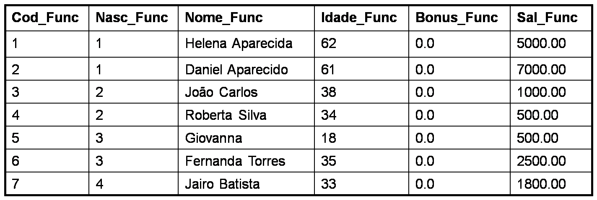

# Recursos de Programação

## **Declaração de Variáveis**

Uma variável é uma área de memória destinada a armazenar temporariamente um ou mais valores, que serão utilizados durante a execução de um programa.

**Comando DECLARE e começa com o sinal de \(@\).**

```text
Declare @variavel datatype
```

**Declarando variáveis**

```sql
Declare @nome char(20), @contador int
```

**Atribuindo valores constantes as variáveis**

```sql
Declare @nome char(20), @contador int
-- Atribuindo valores constantes as variáveis

SET @nome = 'José da Silva' 
SET @contador = 1
```

**Exibindo valor das variáveis**

```sql
Declare @nome char(20), @contador int 
SET @nome = 'José da Silva' 
SET @contador = 1
-- Exibindo valor das variáveis
SELECT @nome 
PRINT @contador
```

**Criando a tabela de funcionário**


```sql
CREATE TABLE [dbo].[Funcionario](
  [Cod_Func] [int] NOT NULL,
  [Nasc_Func] [int] NULL,
  [Nome_Func] [varchar](50) NULL,
  [Idade_Func] [int] NULL,
  [Bonus_Func] [float] NULL,
  [Sal_Func] [float] NULL
 )
```

**Inserindo dados na tabela de funcionário**

```sql
insert into Funcionario
    values (1,1,'Helena Aparecida',62,0,5000)
insert into Funcionario
    values (2,1,'Daniel Aparecido',61,0,7000)
insert into Funcionario
    values (3,2,'João Carlos',38,0,1000)
insert into Funcionario
    values (4,2,'Roberta Silva',34,0,500)
insert into Funcionario
    values (5,3,'Giovanna',18,0,500)
insert into Funcionario
    values (6,3,'Fernanda Torres',35,0,2500)
insert into Funcionario
    values (7,4,'Jairo Batista',33,0,1800)
```

**Atribuindo valor contido em um campo do banco de dados a uma variável**

```sql
Declare @nome char(20)
SELECT @nome = Nome_Func FROM Funcionario 
    WHERE Cod_Func = 1
```

## **Teste de condição com o comando IF**

**Exemplo 1**



Se o funcionário de código 1 tiver 50 anos ou mais, aplique-lhe um aumento salarial de 50%.

```sql
IF (SELECT Idade_Func FROM Funcionario WHERE Cod_Func =1 ) >= 50
     UPDATE Funcionario SET
          Sal_Func = Sal_Func * 1.5
     WHERE Cod_Func = 1
```

**Exemplo 2**


Se o funcionário de código 3 tiver 50 anos ou mais, aplique-lhe um aumento salarial de 50%; caso contrário, aplique para o funcionário um aumento salarial de 40%

```sql
IF (SELECT Idade_Func FROM Funcionario WHERE Cod_Func =3 ) >= 50
     UPDATE Funcionario 
     SET  Sal_Func = Sal_Func * 1.5 
     WHERE Cod_Func = 3
ELSE
     UPDATE Funcionario 
     SET Sal_Func = Sal_Func * 1.4 
     WHERE Cod_Func = 3
```

**Exemplo 3**


Se o funcionário de código 4 tiver 50 anos ou mais, aplique-lhe um aumento salarial de 50%. Se não, se o funcionário de código 4 tiver uma idade entre 40 e 49 anos, aplique-lhe um aumento salarial de 40%

```sql
Declare @idade Tinyint
Declare @Cod_Func int
SET @Cod_Func = 4
SELECT @idade = Idade_Func FROM Funcionario 
     WHERE Cod_Func = @Cod_Func
IF @idade >= 50
     UPDATE Funcionario 
     SET  Sal_Func = Sal_Func * 1.5 
     WHERE Cod_Func = @Cod_Func
ELSE IF @idade BETWEEN 40 AND 49
     UPDATE Funcionario 
     SET Sal_Func = Sal_Func * 1.4 
     WHERE Cod_Func = @Cod_Func
```

**Exemplo 4**


* Se o funcionário de código 1 tiver 50 anos ou mais, aplique-lhe um aumento salarial de 50% e um bônus de 500 reais.
* Se não, se o funcionário de código 1 tiver uma idade entre 40 e 49 anos, aplique-lhe um aumento salarial de 40% e um bônus de 1000 reais.
* Se não, se o funcionário de código 1 tiver uma idade entre 30 e 39 anos, aplique-lhe um aumento salarial de 30% e um bônus de 1500 reais.
* Caso contrário, aplique-lhe um aumento salarial de 20% e um bônus de 2000 reais.

```sql
DECLARE @idade Tinyint, 
        @aumento decimal(2,1), 
        @bonus decimal(6,2)
SELECT @idade = Idade_Func FROM Funcionario WHERE Cod_Func = 1
IF @idade >= 50
     Begin
             SET @aumento = 1.5
             SET @bonus = 500.00
     End
ELSE IF @idade BETWEEN 40 AND 49
     Begin
             SET @aumento = 1.4
             SET @bonus = 1000.00 
     End 
ELSE IF @idade BETWEEN 30 AND 39
     Begin
             SET @aumento = 1.3
             SET @bonus = 1500.00
     End
ELSE
 Begin
             SET @aumento = 1.2
             SET @bonus = 2000.00
     End
UPDATE Funcionario
     SET Sal_Func = Sal_Func * @aumento, Bonus_Func = @bonus 
WHERE Cod_Func = 1
```

## **Teste de condição com o comando Select Case**

Este comando analisa o valor de uma variável ou coluna de tabela com relação a uma lista de condições e retorna um dos resultados dessa lista. O comando Case pode ter dois formatos:

```text
CASE  expressão, variável ou coluna_de_tabela
        WHEN condição1 THEN resultado1
        WHEN condição2 THEN resultado2
        WHEN condição3 THEN resultado3
        ---
       WHEN condiçãon THEN resultadon
       ELSE resultadox
END
```

```text
CASE 
        WHEN expbooleana1 THEN resultado1
        WHEN expbooleana2 THEN resultado2
        WHEN expbooleana3 THEN resultado3
        ---
       WHEN expbooleanan THEN resultadon
       ELSE resultadox
END
```

Exiba todos os dados de cada funcionário e dependendo do valor da coluna Nasc\_Func \(nacionalidade do funcionário\), exiba:

* Se a Nacionalidade = 1 escreva “Brasileira”
* Se a Nacionalidade = 2 escreva “Chinesa”
* Se a Nacionalidade = 3 escreva “Japonesa”
* Caso contrário, escreva “Desconhecida”

```sql
SELECT Cod_Func, Nome_Func, Idade_Func, Bonus_Func, Sal_Func,
            ‘Nacionalidade’ =
                        CASE Nasc_Func
                                   WHEN 1 Then ‘Brasileira’
                                   WHEN 2 Then ‘Chinesa’
                                   WHEN 3 Then ‘Japonesa’
                                   ELSE ‘Desconhecida’
                        END
FROM Funcionario
```

Exiba todos os dados de cada funcionário e dependendo da idade de cada um, exiba uma das seguintes frases:

* Se Idade\_Func está entre 18 e 30 escreva “Trabalhador Jovem”
* Se Idade\_Func está entre 30 e 40 escreva “Trabalhador Adulto – Fase 1”
* Se Idade\_Func está entre 40 e 50 escreva “Trabalhador Adulto – Fase 2”•Se Idade\_Func está entre 50 e 60 escreva “Trabalhador Adulto – Fase 3”
* Se Idade\_Func está entre 60 e 65 escreva “Trabalhador Adulto – Fase 4”
* Se Idade\_Func é maior que  65 escreva ‘Trabalhador Aposentado’

```sql
SELECT *,
    ‘Fase’ =
       CASE
           WHEN Idade_Func BETWEEN 18 AND 29 Then ‘Trabalhador Jovem’
           WHEN Idade_Func BETWEEN 30 AND 39 Then ‘Trabalhador Adulto – Fase 1’
           WHEN Idade_Func BETWEEN 40 AND 49 Then ‘Trabalhador Adulto – Fase 2’
           WHEN Idade_Func BETWEEN 50 AND 59 Then ‘Trabalhador Adulto – Fase 3’
          WHEN Idade_Func BETWEEN 60 AND 65 Then ‘Trabalhador Adulto – Fase 4’
          WHEN Idade_Func > 65  Then ‘Trabalhador Aposentado’
      END
FROM Funcionario
```

## **Laço de Repetição - While**

WHILE condição\_1 = verdadeiro

```text
BEGIN
         ação_1
         ação_2
         ...
         ação_n
         [SE condição_2 = verdadeira
                 CONTINUE
           ELSE
                     BREAK
END
```

```sql
DECLARE @i INT
DECLARE @max INT
DECLARE @nome varchar(20)
Select @max = max(cod_func) from funcionario
Select @i = min(cod_func) from funcionario
while @i <= @max
begin
  select @nome = nome_func from funcionario
  where cod_func = @i
  print @nome
  set @i = @i + 1
end
```

Leia o salário do funcionário de código 1 e aplique-lhe um bônus salarial nestas condições: desconte 10% do salário desse funcionário até que o valor obtido como resposta seja igual ou inferior a 1000 reais. Se o valor do bônus calculado mais o valor do bônus armazenado for menor do que 1000 reais, atribua ao bônus o valor de 1000 reais e encerre o processo.

```sql
DECLARE @salario decimal(10,2), @bonus decimal(10,2)
SELECT @salario = Sal_Func, @bonus = Bonus_Func FROM Funcionario WHERE Cod_Func = 1
WHILE @salario > 1000.00
Begin
        SET @salario = @salario * 0.9
        SET @bonus = @bonus + @salario
        IF @bonus < 1000
            Begin
                   SET @bonus = 1000.00
                   BREAK
            END
      ELSE
             CONTINUE
END
UPDATE Funcionario
                    SET Bonus_Func = @bonus
WHERE Cod_Func = 1
```

