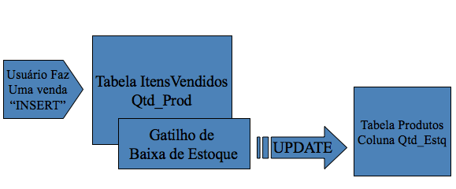
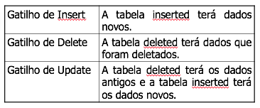
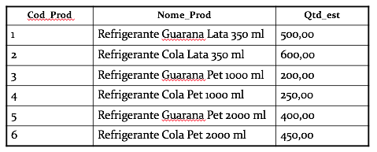

# Triggers

É um tipo especial de Stored Procedure, que executa tarefas de manipulação de dados dentro de um banco de dados. Os gatilhos, são executados indiretamente, pelos comandos INSERT e/ou UPDATE e/ou DELETE.

Os gatilhos não recebem parâmetros de entrada, sendo assim, para que seja possível manipular, dentro do gatilho, os dados que estão sendo afetados pelo comando que acionou o gatilho, existem as tabelas chamadas **INSERTED** e **DELETED**.



Tabelas INSERTED e DELETED

Essas tabelas são criadas na memória em tempo de execução do gatilho e você só pode realizar o comando SELECT sobre elas.

Os três tipos de gatilhos têm as duas tabelas, mas nos gatilhos de Insert apenas a tabela inserted terá dados. Nos gatilhos delete apenas deleted terá dados. Nos gatilhos de update as duas tabelas inserted e deleted terão dados – a tabela deleted terá os dados da forma como eles eram antes de o update ser feito e a tabela inserted terá os dados novos já modificados.

As tabelas inserted e deleted terão a mesma estrutura da tabela base do gatilho, e o dados afetados pelo comando que aciona os gatilhos.



Sintaxe

```sql
CREATE TRIGGER Nome_Gatilho
ON tabela_base
FOR INSERT/UPDATE/DELETE
AS
     Corpo da gatilho
```

Exemplo de Gatilhos

Suponha clientes comprando produtos por meio de pedidos. Esses clientes podem fazer vários pedidos e em cada pedido que fazem podem comprar muitos produtos. Você realiza a venda de cada produto, registrando os dados na tabela **ItensVendidos**. A cada item vendido, seu sistema deve realizar a baixa da quantidade vendida desse produto no estoque. Para fazer esta baixa de estoque, você pode utilizar um gatilho.

Vamos acrescentar no banco dados de exemplo as seguintes tabelas:

```sql
CREATE TABLE ItensVendidos
(
    Num_Ped int,
    Cod_Prod int,
    Qtd_Prod float,
    Data_Ped datetime
)
```

```sql
CREATE TABLE Produto
(
    Cod_Prod int,
    Nome_Prod varchar(50),
    Qtd_Est float
)
```

Vamos popular a tabela de produtos com dados abaixo



Comandos para popular a tabela de produtos

```sql
insert into Produto
values (1,        'Refrigerante Guarana Lata 350 ml',500)
insert into Produto
values (2,        'Refrigerante Cola Lata 350 ml',600)
insert into Produto
values (3,        'Refrigerante Guarana Pet 1000 ml',200)
insert into Produto
values (4,        'Refrigerante Cola Pet 1000 ml',250)
insert into Produto
values (5,        'Refrigerante Guarana Pet 2000 ml',400)
insert into Produto
values (6,        'Refrigerante Cola Pet 2000 ml',450)
```

```sql
CREATE TRIGGER T_Baixa
ON ItensVendidos
FOR INSERT
AS
  UPDATE Produto
  SET Produto.Qtd_Est = Produto.Qtd_Est - Inserted.Qtd_Prod
  FROM Inserted
  Where Produto.Cod_Prod = inserted.Cod_Prod
  IF @@ERROR <> 0
  BEGIN
     ROLLBACK TRANSACTION
     RAISERROR('Erro de Processamento – Chame o Adminitrador', 16,1)
     RETURN
  END
```

Para disparar o gatilho anterior, execute o seguinte comando:

```sql
INSERT itensVendidos  (Num_Ped, Cod_Prod, Qtd_Prod, data_ped) VALUES (1,3,5,getdate()-10)
INSERT itensVendidos  (Num_Ped, Cod_Prod, Qtd_Prod, data_ped) VALUES (2,3,5,getdate()-1)
```

Exemplo 2 - Gatilhos

Estes comandos realizam uma venda de 5 unidades do produto de código 3 para o pedido de número 1 com data de dez dias atrás e uma venda de 5 unidades do produto de código 3 para o pedido de número 2 com data de 1 dia atrás.

Suponha que nessa empresa você aceita que seus clientes devolvam os produtos que foram comprados até 5 dias corridos atrás. Esta devolução deve ser refletida no estoque. Você deve recolocar esse produto no estoque e disponibilizá-lo novamente para venda, acrescentando-o ao estoque. Para tanto você poderia utilizar o gatilho a seguir:

```sql
CREATE TRIGGER T_Devolucao
ON ItensVendidos
FOR DELETE
AS
  declare @data datetime
  set @data = (select min(Data_Ped) from deleted)
  IF (DateDiff(dd, @data, GetDate())) <= 5
  BEGIN
    UPDATE Produto
    SET Produto.Qtd_Est = Produto.Qtd_Est + deleted.Qtd_Prod
    FROM deleted
    WHERE Produto.Cod_Prod = deleted.Cod_Prod
IF @@ERROR <> 0
    BEGIN
      ROLLBACK TRANSACTION
      RAISERROR('Erro de Processamento – Chame o Administrador', 16,1)
      RETURN
    END
   END
   ELSE
   BEGIN
     RAISERROR('Prazo de Devolução vencido – Operação rejeitada',16,1)
     ROLLBACK TRANSACTION
     RETURN
  END
```

Observe que este é um tigger de deleção \(FOR DELETE\) e quando uma linha for excluída da tabela ItensVendidos, o gatilho será acionado e fará um Update na tabela Produto, acrescentando a quantidade que havia sido vendida de volta ao estoque, caso a data do pedido seja de até 5 dias. Caso contrário a tentativa exclusão é descartada

Os comandos seguintes acionam a execução do gatilho anterior:

```sql
DELETE ItensVendidos Where Num_Ped = 1
DELETE ItensVendidos Where Num_Ped = 2
```

Exemplo 3 – Gatilhos

A empresa poderia também, num mesmo prazo de 5 dias, aceitar troca de produtos para o mesmo pedido. Para tanto, você deve escrever um gatilho que recolocasse no estoque o produto a ser devolvido e retirasse do estoque o produto que será levado pelo cliente. Veja a listagem a seguir:

```sql
CREATE TRIGGER T_Troca
ON ItensVendidos
FOR UPDATE
AS
  declare @data datetime
  set @data = (select min(Data_Ped) from deleted)
  IF (DateDiff(dd, @data, GetDate())) <= 5
  BEGIN
  -- Baixa produtos inseridos
      UPDATE Produto
      SET Produto.Qtd_Est = Produto.Qtd_Est - Inserted.Qtd_Prod
      FROM Inserted
      Where Produto.Cod_Prod = inserted.Cod_Prod
  -- Acrescenta produtos retirados
      UPDATE Produto
      SET Produto.Qtd_Est = Produto.Qtd_Est + deleted.Qtd_Prod
      FROM deleted
      WHERE Produto.Cod_Prod = deleted.Cod_Prod
IF @@ERROR <> 0
    BEGIN
      ROLLBACK TRANSACTION
      RAISERROR('Erro de Processamento – Chame o ADM',16,1)
      RETURN
    END
  END
  ELSE
  BEGIN
    RAISERROR('Prazo de troca vencido – Operação rejeitada',16,1)
    ROLLBACK TRANSACTION
    RETURN
  END
```

Observe que este é um gatilho de Update \(FOR UPDATE\) e quando uma linha da tabela ItensVendidos for alterada, o gatilho será acionado e fará um Update na tabela Produto, acrescentando ao estoque a quantidade do produto devolvido e retirando do estoque a quantidade do novo produto a ser levado pelo cliente caso a data do pedido seja de até 5 dias. Caso contrário a alteração é descartada.

Os comandos a seguir acionam a execução deste gatilho:

```sql
Update ItensVendidos set Cod_Prod = 1, Qtd_Prod = 8
where Num_Ped = 1 AND Cod_Prod = 3
Update ItensVendidos set Cod_Prod = 1, Qtd_Prod = 8
where Num_Ped = 2 AND Cod_Prod = 3
```

Observe que um gatilho de update será acionado sempre que um update for executado na tabela, não importando qual coluna dessa tabela esteja sendo alterada.

Por exemplo, se você alterar a data de um pedido o gatilho executara a movimentação de estoque prevista e a verificação de data no comando desnecessariamente uma vez que os itens não foram alterados

Para fazer com que o update da tabela seja acionado apenas se uma determinada coluna da tabela tenha sido alterada, utilize a função

**If Update\(\)**

```sql
declare @data datetime
  set @data = (select min(Data_Ped) from deleted)
 IF UPDATE(Qtd_Prod) OR UPDATE(Cod_Prod)
  BEGIN
  IF (DateDiff(dd, @data, GetDate())) <= 5
  BEGIN
  -- Baixa produtos inseridos
      UPDATE Produto
      SET Produto.Qtd_Est = Produto.Qtd_Est - Inserted.Qtd_Prod
      FROM Inserted
      Where Produto.Cod_Prod = inserted.Cod_Prod
  -- Acrescenta produtos retirados
      UPDATE Produto
      SET Produto.Qtd_Est = Produto.Qtd_Est + deleted.Qtd_Prod
      FROM deleted
      WHERE Produto.Cod_Prod = deleted.Cod_Prod
```

**If Update**

Como mostrado no exemplo anterior, o If Update deve ser inserido antes dos comandos que alteram dados ou verificam restrições de permissão de alteração dos dados.

Com isso os dados só serão alterados ou condições analisadas caso as colunas envolvidas nestas operações sejam alteradas, caso contrário, o comando de Update ocorrerá normalmente.

**Seqüência de execução dos Gatilhos**

Como já foi dito anteriormente, uma tabela pode ter apenas gatilhos de insert, delete e update, só que cada tabela pode ter vários gatilhos de insert sobre ela, vários gatilhos de update e de delete.

Suponha que você tenha criado uma tabela chamada TabA e tenha criado para ela quatro gatilhos de insert com os seguintes nomes: T\_IncUM, T\_IncDois, T\_IncTres e T\_IncQuatro. Esses quatro gatilhos serão acionados, na ordem em que foram criados, quando ocorrer um insert na tabela TabA.

Se você não quiser que estes gatilhos seja acionados na ordem em que foram criados, pode determinar qual deles deve ser acionado primeiro e qual deles deve ser acionado por último. Veja como:

```sql
Exec SP_SetTriggerOrder ‘T_IncQuatro’, ‘FIRST’, ‘INSERT’
Exec SP_SetTriggerOrder ‘T_IncTres’, ‘LAST’, ‘INSERT’
```

Observe que você pode especificar uma determinada ordem de execução para os gatilhos de Insert, uma outra ordem de execução para os gatilhos de Update e uma outra ordem para os gatilhos de Delete.

**Laboratório1**: Se você quiser observar esta ordem de execução sendo respeitada, execute no seu computador o exemplo seguinte:

```sql
CREATE TABLE Pessoa
(
       Num_Pes int,
       Nome_Pes char(20)
)
```

```sql
CREATE TRIGGER T_IncPes1
ON Pessoa
AFTER INSERT
AS PRINT ‘Teste 1’
GO
```

```sql
CREATE TRIGGER T_IncPes2
ON Pessoa
AFTER INSERT
AS PRINT ‘Teste 2’
GO
```

```sql
CREATE TRIGGER T_IncPes3
ON Pessoa
AFTER INSERT
AS PRINT ‘Teste 3’
GO
```

```sql
CREATE TRIGGER T_IncPes4
ON Pessoa
AFTER INSERT
AS PRINT ‘Teste 4’
GO
```

Execute os seguintes comandos, após compilar os gatilhos:

```sql
Exec SP_SetTriggerOrder ‘T_IncPes4’, ‘FIRST’, ‘INSERT’
Exec SP_SetTriggerOrder ‘T_IncPes2’, ‘LAST’, ‘INSERT’
```

Observe a seqüência de execução dos gatilhos a cada vez que um insert for executado na tabela Pessoa.

**Gatilhos Instead Of**

Faz com que o SQL Server execute as ações especificadas por um gatilho, em vez de executar a ação que o acionou. No exemplo seguinte, quando um usuário tentar executar uma exclusão de algum funcionário da tabela funcionario, o triger T\_DelFun será acionado. Ele enviará uma mensagem para a aplicação que tentou excluir o funcionário da tabela e a Deleção do registro não será efetuada.

```sql
/* A Tabela Funcionário */
CREATE TABLE Funcionario
(
   Cod_Func int                      not null,
   Nome_Func char(20)          not null,
   Sal_Func      decimal(10,2)  not null
)
GO
```

```sql
/* Gatilho que evita exclusão de Funcionario/*
CREATE TRIGGER T_DelFunc
ON Funcionario
INSTEAD OF DELETE
AS
   RAISERROR(‘Operação Inválida’,16,1)
GO
```

Desabilitando e Reabilitando um Gatilho

De acordo com o exemplo dado anteriormente, o gatilho T\_DelFunc não permite que seja feita uma exclusão de dados da tabela Funcionario. Se você precisar executar uma exclusão de dados na tabela Funcionario, pode desabilitar o gatilho, excluir os dados adequados e reabilitar o gatilho:

```sql
ALTER TABLE Funcionario
DISABLE TRIGGER T_DelFunc
```

```sql
DELETE Funcionario WHERE Cod_Func = 1
```

```sql
ALTER TABLE Funcionario
ENABLE TRIGGER T_DelFunc
```

**Gatilho Aninhado**

O aninhamento dos gatilhos é configurado por default. Isto faz com que um gatilho possa, indiretamente, acionar outro gatilho e assim por diante. Por exemplo, sunponha que você tenha cinco tabelas: TabA, TabB, TabC, TabD e TabE, e também que tenha criado um gatilho de insert sobre a tabela TabA que insere um dado na tabela TabB, na TabB sunponha que você tenha um gatilho de insert que insere um dado na tabela TabC, na TabC sunponha que você tenha um gatilho que insere um dado na TabD e na TabD sunponha que você tenha um gatilho de insert que insere um dado na tabela TabE.

Sendo assim, quando um usuário fizer uma inclusão de dados na tabela TabA, todos os quatro gatilhos serão acionados, um após o outro, e cinco inserções serão feitas, uma em cada tabela.

```sql
/* Criando as cincos tabelas */
CREATE TABLE TabA (Coluna char(1))
CREATE TABLE TabB (Coluna char(1))
CREATE TABLE TabC (Coluna char(1))
CREATE TABLE TabD (Coluna char(1))
CREATE TABLE TabE (Coluna char(1))
```

```sql
/* Criando os quatro gatilhos */
CREATE TRIGGER T_IncTabA
ON TabA FOR INSERT
AS INSERT TabB VALUES (‘B’)
```

```sql
/* Criando os quatro gatilhos */
CREATE TRIGGER T_IncTabB
ON TabB FOR INSERT
AS INSERT TabC VALUES (‘C’)
```

```sql
/* Criando os quatro gatilhos */
CREATE TRIGGER T_IncTabC
ON TabC FOR INSERT
AS INSERT TabD VALUES (‘D’)
```

```sql
/* Criando os quatro gatilhos */
CREATE TRIGGER T_IncTabD
ON TabD FOR INSERT
AS INSERT TabE VALUES (‘E’)
```

```sql
/* Inserindo um dado na tabela TabA – Este insert aciona a execução dos quatro gatilhos */
INSERT TabA VALUES (‘A’)
```

```sql
/* Verificando as 5 inserções */
SELECT * FROM TabA
SELECT * FROM TabB
SELECT * FROM TabC
SELECT * FROM TabD
SELECT * FROM TabE
```

O aninhamento dos gatilhos não pode ultrapassar 32 níveis. Se este limite for ultrapassado, o SQL Server emite uma mensagens de erro e faz um ROLLBACK de todas as operações, inclusive daquela que acionou a execução dos gatilhos.

Você pode configurar a opção que habilita e desabilita o aninhamento de gatilhos, através do Enterprise Manager. Clique com o botão direito do mouse sobre o nome do servidor, selecione a opção properties. Depois clique em “Advanced” e configure “**Allow Triggers to Fire others”.**

Esta configuração pode ser feita com a system stored procedure **SP\_Configure**. O valor 1 configura a opção e o desconfigura.

```sql
Exec SP_Configure ‘Nested Trigger’ , 0
```

**Gatilhos Recursivos**

Por default, o SQL Server não executa um gatilho que aciona a sim mesmo. Por exemplo, suponha que você tenha uma tabela chamada TabA e tenha também sobre ela um triger que insere um dado na própria tabela TabA. Neste caso, o SQL Server inserirá apenas duas linhas de dados na tabela TabA quando o usuário inserir diretamente um dado nela. Veja o exemplo a seguir:

```sql
/* Criando a tabela TabA */
CREATE TABLE TabA(Coluna char(1))
```

```sql
/* Criando um gatilho sobre a tabela TabA que insere dado na própria tabela TabA */
CREATE TRIGGER T_IncTabA
ON TabA FOR INSERT
AS
    INSERT TabA VALUES (‘A’)
```

```sql
/* Inserindo um dado na tabela TabA */
INSERT TabA VALUES (‘A’)
```

```sql
/* Verifique que para esta inserção o SQL Server insere na tabela TabA dois registros */
SELECT * FROM TabA
```

Se você quiser que a recursividade seja acionada, pode fazer esta configuração de uma das duas formas:

Utilizando o Enterprise Manager, clique com o botão direito sobre o nome do banco de dados, escolha a opção Properties. Na tela que segue escolha a guia Options. Em seguida configure a opção “**Recursive Triggers**”.

Se quiser, pode realizar esta configuração executando o comando ALTER DATABASE. Observe:

```sql
ALTER DATABASE Editora SET RECURSIVE_TRIGGERS ON
```

Quando você configura seu database para acionar gatilhos recursivos, terá que proporcionar uma forma, dentro do gatilho, para que o SQL Server não exceda os 32 níveis permitidos no aninhamento dos gatilhos. Por exemplo:

```sql
CREATE TRIGGER T_IncTabA
ON TabA FOR INSERT
AS
    IF (SELECT Count(*) FROM TabA, Inserted
         WHERE TabA.Coluna = Inserted.Coluna) <= 10
INSERT TabA VALUES (‘A’)
Trigers Sobre Views
```

Se precisar, você pode criar gatilhos INSTEAD OF sobre views. Observe:

```sql
CREATE VIEW dbo.V_Func
AS
SELECT Nome_Func, Sal_Func
               FROM dbo.Funcionario
```

```sql
/* Criando o gatilho sobre a visão */
CREATE TRIGGER T_DelVFunc
ON dbo.V_Func
INSTEAD OF DELETE
AS RAISERROR(‘Exclusão Rejeitada’,16,1)
```

**Nota**: você não pode colocar a cláusula WITH CHECK OPTION em uma view se ela tiver que ter um gatilho sobre ela.

Comandos que não podem ser colocados em um gatilho \(SQL Server\):

```text
ALTER DATABASE
CREATE DATABASE
DISK INIT
DISK RESIZE
DROP
LOAD DATABASE
LOAD LOG
RECONFIGURE
RESTORE DATABASE
RESTOTE LOG
```

**For ou After Gatilhos**

Os after gatilhos são executados depois que a ação de Insert, Delete ou Update que os acionou for executada. Especificar a cláusula AFTER é a mesma coisa que especificar a cláusula FOR. After gatilhos só podem ser especificados em tabelas, não em views.

**Criando Tabela de Log**

```sql
CREATE TABLE [dbo].[Log](
            [IDLog] [int] IDENTITY(1,1) NOT NULL,
            [Data] [datetime] NULL,
            [Tabela] [varchar](50) NULL,
            [Campo] [varchar](50) NULL,
            [Conteudo] [varchar](50) NULL,
            [Operacao] [char](1) NULL
) ON [PRIMARY]
```

**Criando Log de alterações com a utilização de gatilhos**

```sql
CREATE TRIGGER T_FuncionarioLog
ON Funcionario
FOR UPDATE
AS
declare @valor varchar (50)
if Update(Cod_Func)
begin
  select @valor = cast(cod_func as varchar(50)) from inserted
  insert into Log
  values (getdate(),'Funcionario','Cod_Func',@valor,'U')
end
```

**Criando Log de alterações com a utilização de gatilhos**

```sql
if Update(Nome_Func)
begin
  select @valor = Nome_Func from inserted
  insert into Log
  values (getdate(),'Funcionario','Nome_Func',@valor,'U')
end
if Update(Sal_Func)
begin
  select @valor = cast(sal_func as varchar(50)) from inserted
  insert into Log
  values (getdate(),'Funcionario','Sal_Func',@valor,'U')
end
```

**Criando Log de alterações com a utilização de gatilhos**

```sql
ALTER TRIGGER T_DelFunc
ON Funcionario
INSTEAD OF DELETE
AS
  declare @valor varchar (50)
  select @valor = cast(cod_func as varchar(50)) from deleted
  insert into Log
  values (getdate(),'Funcionario','*','Tentativa de exclusão do funcionario ' + @valor,'D')
GO
```

