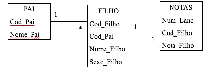

# Views

Uma visão é um objeto do SQL Server utilizado para dar nome a uma query. Os comandos que podem ser Utilizados dentro do código de criação de uma visão são:

• Join

• Union

• Group By com função de totalização

• subquery

As visões podem ser usadas para diferentes propósitos:

• Restringir o uso de colunas e/ou linhas específicas de tabelas – isto é, para controlar o acesso a uma parte específica de uma ou mais tabelas.

• Para ocultar os detalhes de consultas complicadas

• Para restringir valores inseridos e atualizados a certas faixas

**Sintaxe**

```text
CREATE VIEW Nome_da_view
             [WITH ENCRYPTION | WITH SCHEMABINDING]
 AS Select
            [WITH CHECK OPTION]
```

Considere a estrutura de tabelas abaixo:



```sql
SELECT Pai.Nome_Pai, Filho.Nome_Filho, Nota.Nota_Filho
FROM Pai, Filho, Nota
WHERE Pai.Cod_Pai = Filho.Cod_Pai
AND Filho.Cod_Filho = Nota.Cod_Filho
```

```sql
CREATE VIEW v_PaiFilhoNota
AS
SELECT Pai.Nome_Pai, Filho.Nome_Filho, Nota.Nota_Filho
FROM Pai, Filho, Nota
WHERE Pai.Cod_Pai = Filho.Cod_Pai
AND Filho.Cod_Filho = Nota.Cod_Filho
Lendo os dados pela visão
```

```sql
Select * from v_PaiFilhoNota
```

**Nota**: essa visão não ocupa espaço do seu disco, porque ela é internamente, um select.

**Criando campo de idade na tabela de funcionario**

```sql
alter table funcionario add Idade_func int null
update funcionario set idade_func = cod_func * 10 + 10
```

**Ocultando linhas**

Para impedir que seus usuários acessem dados, por exemplo, dos funcionários cuja idade é mais de 40 anos, basta colocar uma cláusula Where, filtrando essas linhas no select dentro da visão

```sql
CREATE VIEW v_Func
AS
    SELECT Cod_Func, Idade_Func, Nome_Func
     FROM Funcionario WHERE Idade_Func <= 40
```

**Ocultando colunas**

Suponha que você queira liberar o acesso aos dados da tabela funcionário, mas não quer liberar o acesso aos dados da coluna Salário:

```sql
ALTER VIEW v_Func
AS
    SELECT Cod_Func, Idade_Func, Nome_Func
     FROM Funcionario
```

**Depois disso é só liberar o acesso aos dados através da visão**

```sql
Exec SP_AddLogin ‘JCUNHA’ , ’123’
Use Banco
Exec SP_GrantDBAccess JCUNHA –cria conta de usuário
GRANT SELECT ON V_FUNC TO JCUNHA – Atribui permissão
```

```sql
SELECT * FROM V_Func
```

**Inserindo, Alterando e Excluindo dados por meio de uma visão**

Por exemplo, suponha que você deseja inserir mais um funcionário na tabela Funcionario por meio da visão V\_Func. Para realizar esta tarefa, você deve escrever o seguinte comando:

```sql
INSERT V_FUNC VALUES (8, 25, 'Jairo Aparecido')
```

**Inserindo, Alterando e Excluindo dados por meio de uma visão**

Se você quisesse alterar dados da tabela Funcionário por meio da visão, deve escrever este comando:

```sql
UPDATE V_FUNC SET
         Idade_Func = Idade_Func + 1
WHERE Cod_Func = 5
```

**Inserindo, Alterando e Excluindo dados por meio de uma visão**

Se precisasse excluir dados da tabela Funcionário por meio da visão, deve escrever este comando:

```sql
DELETE V_FUNC
WHERE Cod_Func = 5
```

**A cláusula With Check Option**

Se você quiser que as operações realizadas com os dados da tabela Funcionário por meio da visão V\_Func obedeçam à cláusula “WHERE Idade\_Func &lt;= 30”, ao código de criação dessa visão acrescente a cláusula With Check Option:

```sql
CREATE VIEW V_Func2
AS
    SELECT Cod_Func, Idade_Func, Nome_Func
    FROM Funcionario WHERE Idade_Func <= 40
With Check Option
```

**A Cláusula With Check Option**

Em seguida, tente executar os comandos seguintes e, veja o que acontece.

```sql
/*Tentando inserir um funcionario inválido */
INSERT V_FUNC2 VALUES(7, 45, 'Fábio')
/*Tentando alterar a idade do funcionário 1 que tem mais de 40 anos */
UPDATE V_FUNC2 SET Idade_Func = Idade_Func + 1 WHERE Cod_Func = 5
/*Tentando alterar a idade para esta ultrapassar 40 anos */
UPDATE V_FUNC2 SET Idade_Func = Idade_Func + 5 WHERE Cod_Func = 3
```

**A cláusula With Encryption**

Quando você cria uma visão, algumas informações sobre ela são registradas nas tabelas do sistema:

• O nome da visão é registrado na tabela sysobjects.

• Os comandos de criação da visão são registrados na tabela do sistema syscomments.

Qualquer usuário que tenha acesso às tabelas do sistema conseguirá ler o código de criação das suas visões.

**A cláusula With Encryption**

Execute os seguintes comandos para ver os códigos-fonte das visões:

```sql
SELECT TEXT FROM SysComments
WHERE Id in (SELECT ID from sysobjects where Name like 'V_Func%')
```

```sql
SELECT TEXT FROM SysComments
WHERE Id= (SELECT ID from sysobjects where Name = ‘V_PaiFilhoNota’)
```

**A cláusula With Encryption**

Se você quiser, pode criptografar o código de criação de suas visões com a cláusula With Encryption:

```sql
CREATE VIEW V_FUNC3
WITH ENCRYPTION
AS
SELECT Cod_Func, Idade_Func, Sum(Sal_Func) AS Salario
FROM Funcionario
Group By Cod_Func, Idade_Func
```

**A cláusula With Schemabinding**

Esta cláusula indica que os objetos \(tables e visões\) referenciados dentro da visão não podem ter sua estrutura alterada e não podem ser eliminados.

```sql
CREATE VIEW V_FUNC4
WITH SCHEMABINDING
AS
     SELECT Cod_Func, Idade_Func, Nome_Func
FROM dbo.Funcionario
WHERE Idade_Func <= 30
```

**visão de visão**

Se for necessário, você pode criar uma visão que filtre dados de outra visão. Mas avalie bem a necessidade de criar visões aninhadas, porque esta prática pode deixar essa parte do seu sistema com problemas de performance.

```sql
/* Primeira visão */
CREATE VIEW V_FUNC_UM
AS
    SELECT Cod_Func,                              Nome_Func,
                 Idade_Func,
                 Nasc_Func
FROM Funcionario
```

```sql
/* Segunda visão */
CREATE VIEW V_FUNC_DOIS
AS
    SELECT  Nome_Func
FROM V_FUNC_UM
WHERE Idade_Func <=30
```

**Junções envolvendo Visões**

Visões podem ser utilizadas em junções.

Para testar vamos criar a tabela de Regiao com os campos Regiao e Regiao\_Descricao, populando-o com as regiões 1 \(Norte\) e 2 \(Sul\).

```sql
/* Criando tabela de Regiao */
CREATE TABLE Nacionalidade(
            Nacionalidade [int] NOT NULL,
            Nacionalidade_Descricao
                 [varchar](50) NULL)
Insert Into Nacionalidade values (1, 'Brasil')
Insert Into Nacionalidade values (2, 'Portugal')
Insert Into Nacionalidade values (3, 'Argentina')
Insert Into Nacionalidade values (4, 'Uruguai')
```

```sql
/* Criando a visão */
CREATE VIEW V_FUNC5
AS
     SELECT Cod_Func, Idade_Func,
        Nome_Func, Nasc_Func
     FROM Funcionario
     WHERE Idade_Func <= 40
```

**Junções envolvendo Visões**

Visões podem ser utilizadas em junções.

```sql
/* Realizando junção envolvendo uma tabela e uma visão*/
SELECT    
V_Func5.Cod_Func, V_Func5.Nome_Func,
V_Func5.Nasc_Func, Nacionalidade.Nacionalidade_Descricao
FROM        
V_Func5
INNER JOIN Nacionalidade ON
  V_Func5.Nasc_Func = Nacionalidade.Nacionalidade
```

