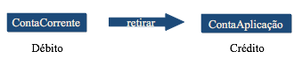

# Transações


O que é uma transação?

É uma unidade lógica de processamento que tem por objetivo preservar a integridade e  a consistência dos dados de um sistema. 



Este requerimento de “ou faz tudo ou não faz nada” é chamado de **atomicidade**.

Para que você realize esta unidade de processamento com atomicidade, você deve abrir a transação, realizar as operações com dados, verificar se algum problema ocorreu. Se todas as operações com dados tiverem sido realizadas com sucesso, você deve confirmar a operação. Caso algum problema tenha ocorrido, você deve garantir que nada seja feito.

Observe o esquema em seguida:

```text
Criar a unidade de processamento
Realizar o DÉBITO
      checar a ocorrência de erro
      se ocorreu algum erro:
           1 – desfaça qualquer operação que tenha sido feita até este ponto.
           2 – interrompa o processamento aqui.
Realizar CRÉDITO
       checar a ocorrência de algum erro.
       se ocorreu erro
            1 – Desfaça qualquer operação que tenha sido feita até este ponto.
            2 – interrompa o processamento aqui.
           Se não ocorrer nenhum problema
               Confirme a operação
```

Para realizar o processamento anterior, você precisa utilizar três comandos:

1. Begin Transaction – cria uma transação, ou seja, cria uma unidade de processamento lógico;
2. Roolback Transaction – encerra a transação e desfaz qualquer operação que tenha sido realizada com dados;
3. Commit Transaction – encerra a transação e efetiva qualquer operação que tenha sido realizada com dados.

```text
BEGIN TRANSACTION
      realizar o débito
      checar a ocorrência de erro
      se ocorreu algum erro:
           1 – ROLLBACK TRANSACTION
           2 – RETURN
Realizar CRÉDITO
       checar a ocorrência de algum erro.
       se ocorreu erro
            1 – ROLLBACK TRANSACTION
            2 – RETURN
           Se não ocorrer nenhum problema
               COMMIT TRANSACTION
```

### @@ERROR

É uma variável global \(função\) “alimentada” pelo próprio SQL Server após a realização de qualquer comando da linguagem Transact\_SQL.

Se não ocorrer erro @@ERROR = 0

Caso ocorra erro

@@ERROR = n• erro \(existente na tabela sysmessages\)

Sendo assim é com a variável @@ERROR que você verifica a ocorrência de erros durante o processamento dos seus dados. Observe o seguinte esquema:

```text
BEGIN TRANSACTION
   Realizar o DÉBITO
         IF @@ERROR <> 0
               BEGIN
                      ROLLBACK TRANSACTION
                      RETURN
               END
Realizar o CRÉDITO
          IF @@ERROR <> 0
               BEGIN
                      ROLLBACK TRANSACTION
                      RETURN
               END
COMMIT TRANSACTION
```

Você pode usar função RAISERROR\(\) para enviar uma mensagem em português mais significativa para a aplicação.

```sql
Exec sp_addmessage 50001, 16, ‘ocorreu um erro de processamento na operação %s ‘
Exec sp_addmessage 50002, 16, ‘conta não encontrada na operação %s ‘
```

**Tabela sysmessages**

```text
BEGIN TRANSACTION
   Realizar o DÉBITO
         IF @@ERROR <> 0
               BEGIN
                      ROLLBACK TRANSACTION
                             RAISERROR(50001, 16, 1, ‘DÉBITO’)
                      RETURN
               END
Realizar o CRÉDITO
          IF @@ERROR <> 0
               BEGIN
                      ROLLBACK TRANSACTION
                           RAISERROR(50001, 16, 1, ‘CRÉDITO’)
                      RETURN
               END
COMMIT TRANSACTION
```

### Criando a Tabela ContaSaldo


Comando de Transferência

```sql
create proc sp_Transferencia
  @valor float, @ContaDeb int, @contaCred int
AS
declare @aROWCOUNT int
BEGIN TRANSACTION
   -- Realiza Debito
   Update ContaSaldo
   Set Saldo = Saldo - @valor
   Where Conta = @ContaDeb
         IF @@ERROR <> 0
               BEGIN
                      ROLLBACK TRANSACTION
                             RAISERROR(50001, 16, 1, 'DÉBITO')
                      RETURN
               END
-- Realiza Credito
   Update ContaSaldo
   Set Saldo = Saldo + @valor
   Where Conta = @ContaCred
   set @aROWCOUNT = @@ROWCOUNT
          IF @@ERROR <> 0
               BEGIN
                      ROLLBACK TRANSACTION
                           RAISERROR(50001, 16, 1, 'CRÉDITO')
                      RETURN
               END
 IF @aROWCOUNT = 0
               BEGIN
                      ROLLBACK TRANSACTION
                           RAISERROR(50002, 16, 1, 'CRÉDITO')
                      RETURN
               END
COMMIT TRANSACTION
```


**-- Realiza a transferência de 100 reais da conta 1 para a 2**

```sql
exec sp_Transferencia 100, 1, 2
```

**-- Realiza a transferência de 50 reais da conta 1 para a 3**

```sql
exec sp_Transferencia 50, 1, 3
```

Este segundo comando reporta a mensagem de erro

### Transação Implícita e Explícita

A transação que é iniciada com BEGIN TRANSACTON e encerrada com COMMIT ou ROLLBACK TRANSACTION é chamada de transação **explícita**.

Se você executar um comando DML \(INSERT, UPDATE OU DELETE\) avulso, ou seja, fora de um BEGIN ou COMMIT TRANSACTION, o SQL Server trata cada um desses comandos como uma transação, ou seja, uma transação **implícita**. Nesse caso a atomicidade é mantida para cada comando individual.

Se você quiser, pode configurar a sua sessão para trabalhar no modo “transação implícita”. Para tanto, basta executar o seguinte código:

```sql
SET IMPLICIT_TRANSACTIONS ON
ALTER TABLE  CREATE DROP GRANT
REVOKE TRANCATE TABLE SELECT
INSERT UPDATE DELETE
SET IMPLICIT_TRANSACTIONS OF
```

O processamento de uma Transação

1. Quando uma transação inicia, ela é registrada no Transaction log.
2. Assim que ela termina, o SQL Server registra no log o COMMIT ou o ROLLBACK.
3. O processo de CHECKPOINT efetiva as transações com COMMIT e registra no log que a respectiva já foi efetivada.
4. O processo que limpa o log retira desse arquivo as transações que já foram efetivadas pelo CHECKPOINT e as transações com ROLLBACK.
5. Se o sistema for interrompido propositadamente ou não, ao ser reiniciado, o processo chamado RECOVER entra em ação. Ele efetiva as transações que estavam com COMMIT, mas que ainda não haviam sido efetivadas, e desfaz qualquer transação que porventura tenha sido processada pela metade devido à interrupção do sistema.
6. O próximo processo que limpa o log retira desse arquivo as transações que já foram efetivadas pelo CHECKPOINT ou pelo RECOVERY e as transações com ROLLBACK, liberando espaço nesse arquivo.

### Transação Aninhada

Uma transação pode ser aberta dentro de outra transação. A variável global @@TRANCOUNT contém um número que indica quantas transações estão abertas em sua sessão. Veja o exemplo a seguir:

```sql
SELECT @@TRANCOUNT    /* é igual a 0 */
BEGIN TRANSACTION primeira
     INSERT INTO Teste_Um values (3)
     IF @@ERROR <> 0
          BEGIN
                   ROLLBACK TRANSACTION  /*Desfaz a primeira transação*/
                   RAISERROR(‘Erro da primeira transação’,16,1)
                   RETURN
          END
BEGIN TRANSACTION segunda
     INSERT INTO Teste_Dois values (‘C’)
     IF @@ERROR <> 0
          BEGIN
                   ROLLBACK TRANSACTION  /*Desfaz a segunda transação*/
                   RAISERROR(‘Erro da segunda transação’,16,1)
                   RETURN
          END
SELECT @@TRANCOUNT   /* A variável @@TRANCOUNT vale 2 */
COMMIT TRANSACTION segunda
SELECT @@TRANCOUNT   /* A variável @@TRANCOUNT vale 1 */
COMMIT TRANSACTION primeira
SELECT @@TRANCOUNT   /* A variável @@TRANCOUNT vale 0 */
```

A marca de Save Point 

Para que você possa confirmar parcialmente uma transação, basta que você atribua um nome a ela. Para que você desfaça uma transação parcialmente, terá que utilizar marcas de “save Point” e desfazer a transação até esta marca:

```sql
BEGIN TRANSACTION
    INSERT INTO Teste_Um values (1)    /* Esta operação é confirmada */
SAVE TRANSACTION Ponto_A    /* marca de SAVE POINT */
    INSERT INTO Teste_Dois values (‘A’)
    SELECT * FROM Teste_Um
    SELECT * FROM Teste_Dois
    ROLLBACK TRANSACTION Ponto_A  /*Apenas INSERT Teste_Dois é desfeito */
COMMIT TRANSACTION   /* Confirma as operações que não foram desfeitas */
```

Para que você possa confirmar parcialmente uma transação, basta que você atribua um nome a ela. Para que você desfaça uma transação parcialmente, terá que utilizar marcas de “save Point” e desfazer a transação até esta marca:

```sql
BEGIN TRANSACTION
    INSERT INTO Teste_Um values (1)    /* Esta operação é confirmada */
SAVE TRANSACTION Ponto_A    /* marca de SAVE POINT */
    INSERT INTO Teste_Dois values (‘A’)
    SELECT * FROM Teste_Um
    SELECT * FROM Teste_Dois
    ROLLBACK TRANSACTION Ponto_A  /*Apenas INSERT Teste_Dois é desfeito */
COMMIT TRANSACTION   /* Confirma as operações que não foram desfeitas */
BEGIN TRAN [SACTION] [ <Nome_Transação>)  | @variável ]
.
COMMIT TRAN [SACTION] [ <Nome_Transação>)  | @variável ]
.
COMMIT [ WORK ]
.
ROLLBACK TRANSACTION [ <Nome_Transação>)  | @variável  | NomeSavePoint | @variável_SavePoint ]
.
ROLLBACK [ WORK ]
.
SAVE TRANSACTION ( Nome_savapoint) | @variável_savepoint)
```


